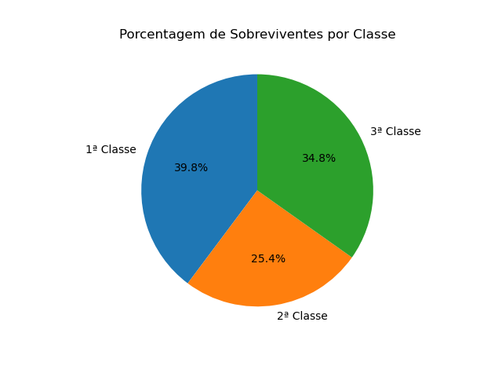
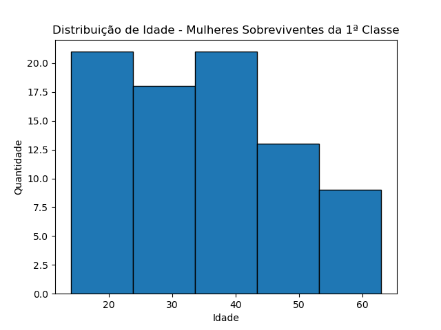

# 🚢 Projeto Titanic - Análise de Sobrevivência

Este projeto explora os dados do famoso naufrágio do Titanic para entender melhor os fatores que influenciaram a sobrevivência dos passageiros, com foco em **classe social** e **gênero**.

---

## 🎯 Objetivos

### 🎯 Objetivo 1 — Análise Geral por Classe
- Calcular a **taxa de sobrevivência por classe** (1ª, 2ª e 3ª).
- Comparar **quantitativamente** o número de sobreviventes por **sexo e classe**.
- Visualizar padrões e desigualdades sociais evidentes no naufrágio.

📈 **Exemplo de gráfico gerado:**

---

### 🎯 Objetivo 2 — Mulheres da Primeira Classe
- Apresentar um *DataFrame* contendo:
  - Nome
  - Idade
  - Sexo  
De todas as **mulheres sobreviventes** que estavam na **primeira classe**.
- Distribuição da idade das sobreviventes dessa classe

📊 **Exemplo de visualização:**

---

## 🧠 Conhecimentos Aplicadoss

- 🔎 Manipulação de dados com **Pandas**
- ✅ Filtragem condicional com múltiplos critérios
- 📊 Visualização de dados com **Seaborn** e **Matplotlib**
- 📁 Exportação de subconjuntos de dados

---

## 📌 Conclusões

A análise mostra claramente que:
- Passageiros da **1ª classe** tiveram maior taxa de sobrevivência.
- Mulheres, especialmente da 1ª classe, estavam entre os grupos mais protegidos.
- As desigualdades sociais ficaram evidentes na distribuição dos sobreviventes.

---

🧪 **Tecnologias utilizadas:**  
`Python`, `Pandas`, `Seaborn`, `Matplotlib`, `Jupyter Notebook`
