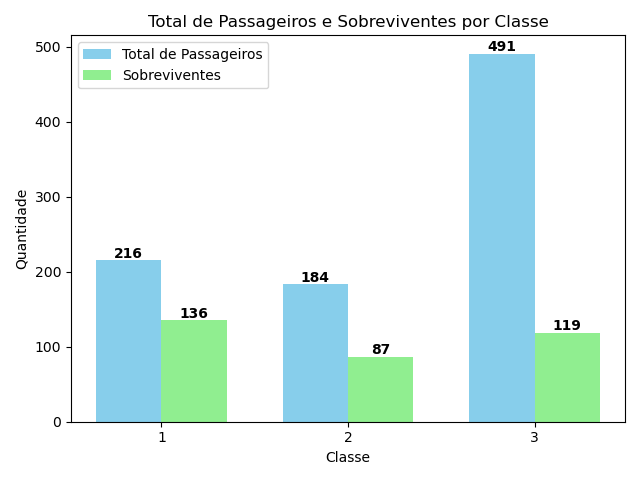
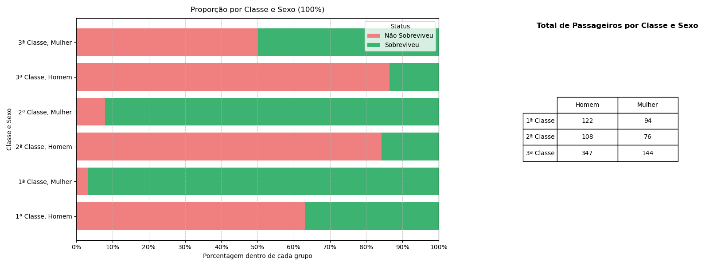

# 🚢 Projeto Titanic - Análise de Sobrevivência

Este projeto utiliza os dados do naufrágio do Titanic para investigar como **classe social** e **gênero** influenciaram as chances de sobrevivência dos passageiros. Através de visualizações e comparações, é possível observar desigualdades marcantes entre os diferentes grupos a bordo.

---

## 🎯 Objetivos da Análise

- Calcular a **taxa de sobrevivência por classe** (1ª, 2ª e 3ª).
- Comparar **quantitativamente** o número de sobreviventes por **sexo e classe**.
- Visualizar **padrões sociais e desigualdades** no contexto do desastre.
- Apresentar os dados de forma clara e acessível, com gráficos e tabelas.

---

## 📊 Panorama Geral

### 📌 Total de Passageiros e Sobreviventes por Classe

- Quantos passageiros havia no total?
- Quantos por classe?
- Quantos sobreviveram em cada classe?

---

## 👥 Composição por Gênero e Classe

- Quantos homens e mulheres havia em cada classe?
- Qual a proporção de sobreviventes em cada grupo?

Este gráfico em barra horizontal empilhada mostra visualmente a **proporção de sobrevivência** por **classe e sexo**, acompanhado de uma tabela com o total de passageiros por grupo.

---

## 🧮 Como a Taxa de Sobrevivência foi Calculada?

A fórmula aplicada:

## 🧠 Conhecimentos Aplicados

Durante este projeto, foram aplicados conceitos fundamentais da análise de dados e boas práticas de apresentação visual, com foco em contar uma história clara e impactante a partir dos números. Os principais conhecimentos utilizados incluem:

- **Manipulação de dados com Pandas**  
  Agrupamentos, filtragens condicionais, criação de colunas auxiliares e cálculo de proporções e médias para responder perguntas específicas da análise.

- **Visualização de dados com Matplotlib**  
  Construção de gráficos de barras e barras empilhadas, inserção de rótulos, formatação de percentuais e layout com múltiplos eixos para visualizações comparativas.

- **Gridspec para layout profissional**  
  Organização de gráficos lado a lado com tabelas, facilitando a interpretação conjunta de diferentes dimensões dos dados.

- **Storytelling de dados**  
  Organização da análise em uma sequência lógica: primeiro o panorama geral, depois a divisão por classe, seguido da composição por gênero e, por fim, a taxa de sobrevivência. Isso permite ao leitor compreender não apenas os números, mas também o contexto social por trás deles.

- **Design centrado na clareza**  
  Gráficos com legendas claras, eixos com porcentagens de 10 em 10%, rótulos nas barras e uso intencional de cores para representar categorias (ex: vermelho para não sobreviventes, verde para sobreviventes), com foco na acessibilidade de leitura.

---
