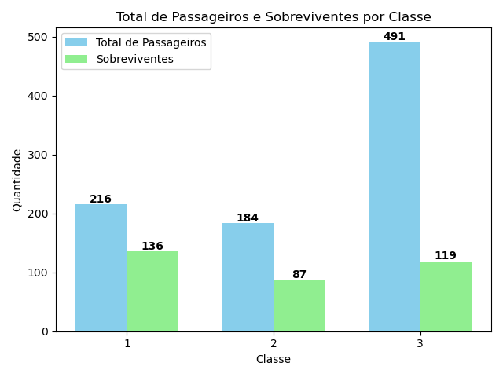

# 🚢 Projeto Titanic - Análise de Sobrevivência

Este projeto utiliza os dados do naufrágio do Titanic para investigar como **classe social** e **gênero** influenciaram as chances de sobrevivência dos passageiros. Através de visualizações e comparações, é possível observar desigualdades marcantes entre os diferentes grupos a bordo.

---

## 🎯 Objetivos da Análise

- Calcular a **taxa de sobrevivência por classe** (1ª, 2ª e 3ª).
- Comparar **quantitativamente** o número de sobreviventes por **sexo e classe**.
- Visualizar **padrões sociais e desigualdades** no contexto do desastre.
- Apresentar os dados de forma clara e acessível, com gráficos e tabelas.

---

## 📊 Panorama Geral

### 📌 Total de Passageiros e Sobreviventes por Classe

- Quantos passageiros havia no total?
- Quantos por classe?
- Quantos sobreviveram em cada classe?

---

## 👥 Composição por Gênero e Classe

- Quantos homens e mulheres havia em cada classe?
- Qual a proporção de sobreviventes em cada grupo?

Este gráfico em barra horizontal empilhada mostra visualmente a **proporção de sobrevivência** por **classe e sexo**, acompanhado de uma tabela com o total de passageiros por grupo.

---

## 🧮 Como a Taxa de Sobrevivência foi Calculada?

A fórmula aplicada:

